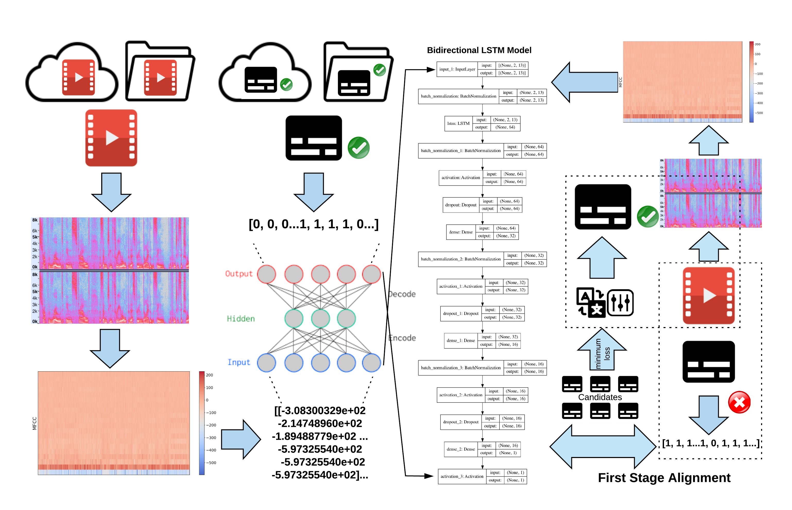
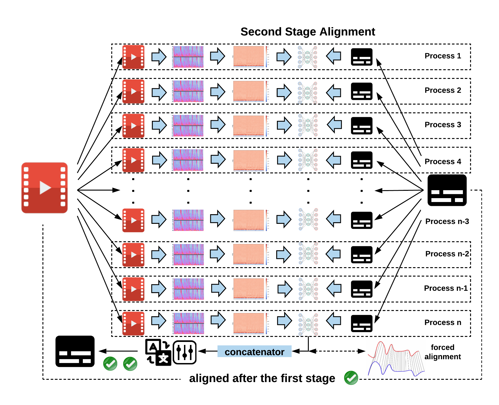

[](https://github.com/baxtree/subaligner/actions/workflows/ci-pipeline.yml?query=branch%3Amaster) 
[](https://www.python.org/downloads/release/python-390/) [](https://www.python.org/downloads/release/python-380/) [](https://www.python.org/downloads/release/python-370/) [](https://www.python.org/downloads/release/python-360/)
[](https://subaligner.readthedocs.io/en/latest/?badge=latest)
[](https://github.com/baxtree/subaligner/blob/master/LICENSE)
[](https://badge.fury.io/py/subaligner)
[](https://hub.docker.com/r/baxtree/subaligner)

<div align="center">
  
</div>

## Dependencies
[FFmpeg](https://www.ffmpeg.org/) and [eSpeak](http://espeak.sourceforge.net/index.html)
```
$ apt-get install ffmpeg espeak libespeak1 libespeak-dev espeak-data
```
or
```
$ brew install ffmpeg espeak
```

## Installation
```
# Install from PyPI (pre-emptive NumPy)
$ pip install -U pip
$ pip install 'numpy~=1.19.2'
$ pip install subaligner
```
or
```
# Install via pipx
$ pip install -U pip pipx
$ pipx install 'numpy~=1.19.2'
$ pipx install subaligner
```
or
```
# Install from GitHub via Pipenv
...
[packages]
numpy = {version='numpy~=1.19.2'}
subaligner = {git = "ssh://git@github.com/baxtree/subaligner.git", ref = "<TAG>"}
...
```
or
```
# Install from source

$ git clone git@github.com:baxtree/subaligner.git
$ cd subaligner
$ pip install 'numpy~=1.19.2'
$ python setup.py install
```
or
```
# Use dockerised installation

$ docker run -v `pwd`:`pwd` -w `pwd` -it baxtree/subaligner bash
```
For users on Windows 10: [Docker Desktop](https://docs.docker.com/docker-for-windows/install/) is the only option at present.
Assuming your media assets are stored under `d:\media`, open built-in command prompt, PowerShell, or Windows Terminal and run:
```
docker pull baxtree/subaligner
docker run -v "/d/media":/media -w "/media" -it baxtree/subaligner bash
```

## Usage
```
# Single-stage alignment (high-level shift with lower latency)

$ subaligner_1pass -v video.mp4 -s subtitle.srt
$ subaligner_1pass -v https://example.com/video.mp4 -s https://example.com/subtitle.srt -o subtitle_aligned.srt
```
```
# Dual-stage alignment (low-level shift with higher latency)

$ subaligner_2pass -v video.mp4 -s subtitle.srt
$ subaligner_2pass -v https://example.com/video.mp4 -s https://example.com/subtitle.srt -o subtitle_aligned.srt
```
or
```
# Pass in single-stage or dual-stage as the alignment mode

$ subaligner -m single -v video.mp4 -s subtitle.srt
$ subaligner -m dual -v video.mp4 -s subtitle.srt
$ subaligner -m single -v https://example.com/video.mp4 -s https://example.com/subtitle.srt -o subtitle_aligned.srt
$ subaligner -m dual -v https://example.com/video.mp4 -s https://example.com/subtitle.srt -o subtitle_aligned.srt
```
```
# Translative alignment with the ISO 639-3 language code pair (src,tgt)

$ subaligner_1pass --languages
$ subaligner_1pass -v video.mp4 -s subtitle.srt -t src,tgt
$ subaligner_2pass --languages
$ subaligner_2pass -v video.mp4 -s subtitle.srt -t src,tgt
$ subaligner --languages
$ subaligner -m single -v video.mp4 -s subtitle.srt -t src,tgt
$ subaligner -m dual -v video.mp4 -s subtitle.srt -t src,tgt
```
```
# Run batch alignment against directories

$ subaligner_batch -m single -vd videos/ -sd subtitles/ -od aligned_subtitles/
$ subaligner_batch -m dual -vd videos/ -sd subtitles/ -od aligned_subtitles/
```
```
# Run alignments with pipx

$ pipx run subaligner -m single -v video.mp4 -s subtitle.srt
$ pipx run subaligner -m dual -v video.mp4 -s subtitle.srt
```
```
# Run the module as a script
$ python -m subaligner -m single -v video.mp4 -s subtitle.srt
$ python -m subaligner -m dual -v video.mp4 -s subtitle.srt
$ python -m subaligner.subaligner_1pass -v video.mp4 -s subtitle.srt
$ python -m subaligner.subaligner_2pass -v video.mp4 -s subtitle.srt
```
```
# Run alignments with the docker image

$ docker pull baxtree/subaligner
$ docker run -v `pwd`:`pwd` -w `pwd` -it baxtree/subaligner subaligner_1pass -v video.mp4 -s subtitle.srt
$ docker run -v `pwd`:`pwd` -w `pwd` -it baxtree/subaligner subaligner_2pass -v video.mp4 -s subtitle.srt
$ docker run -it baxtree/subaligner subaligner_1pass -v https://example.com/video.mp4 -s https://example.com/subtitle.srt -o subtitle_aligned.srt
$ docker run -it baxtree/subaligner subaligner_2pass -v https://example.com/video.mp4 -s https://example.com/subtitle.srt -o subtitle_aligned.srt
```
The aligned subtitle will be saved at `subtitle_aligned.srt`. For details on CLI, run `subaligner_1pass -h`, `subaligner_2pass -h` or `subaligner -h`.
Additional utilities can be used after consulting `subaligner_batch -h`, `subaligner_convert -h`, `subaligner_train -h` and `subaligner_tune -h`.


## Supported Formats
Subtitle: SubRip, TTML, WebVTT, (Advanced) SubStation Alpha, MicroDVD, MPL2, TMP, EBU STL, SAMI, SCC and SBV.

Video/Audio: MP4, WebM, Ogg, 3GP, FLV, MOV, Matroska, MPEG TS, WAV, MP3, AAC, FLAC, etc.

## Advanced Usage
You can train a new model with your own audiovisual files and subtitle files:
```
$ subaligner_train -vd VIDEO_DIRECTORY -sd SUBTITLE_DIRECTORY -tod TRAINING_OUTPUT_DIRECTORY
```
Then you can apply it to your subtitle synchronisation with the aforementioned commands. For more details on how to train and tune your own model, please refer to [Subaligner Docs](https://subaligner.readthedocs.io/en/latest/advanced_usage.html).

## Anatomy
Subtitles can be out of sync with their companion audiovisual media files for a variety of causes including latency introduced by Speech-To-Text on live streams or calibration and rectification involving human intervention during post-production.

A model has been trained with synchronised video and subtitle pairs and later used for predicating shifting offsets and directions under the guidance of a dual-stage aligning approach. 

First Stage (Global Alignment):


Second Stage (Parallelised Individual Alignment):
